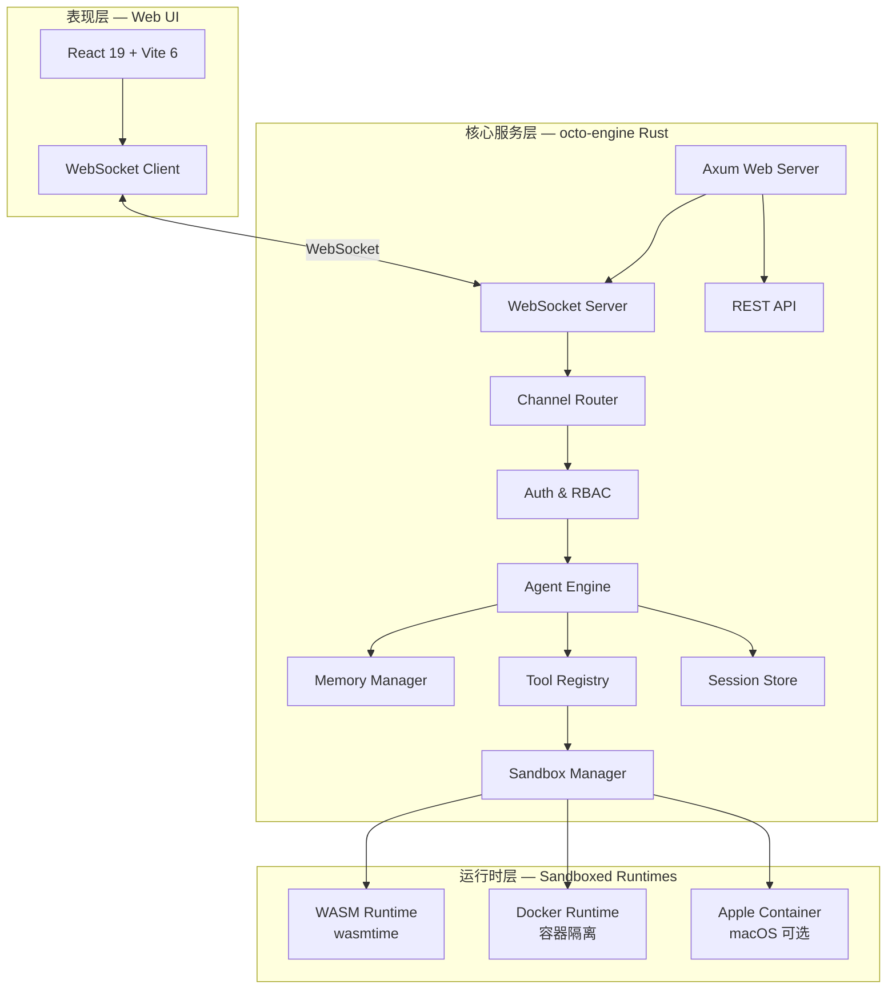
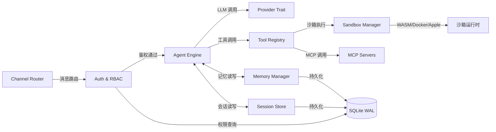
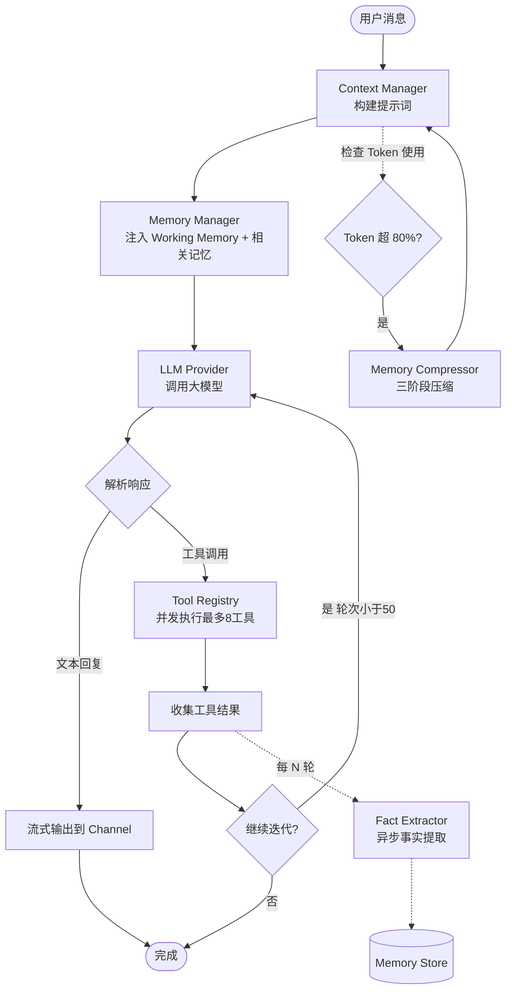
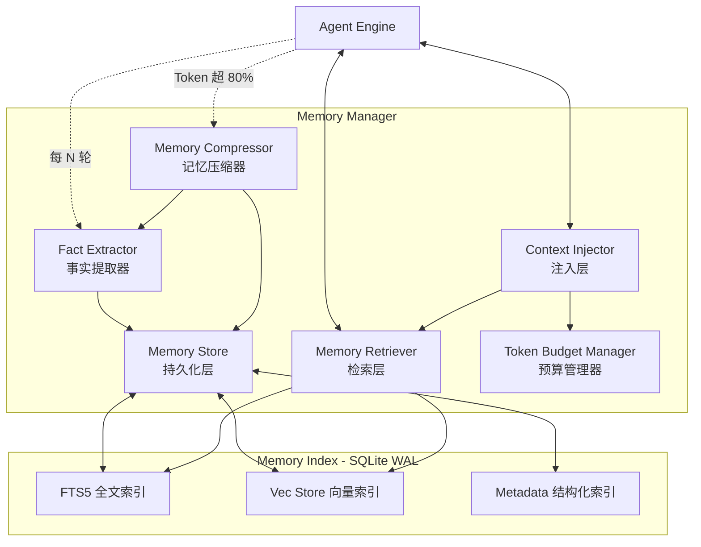
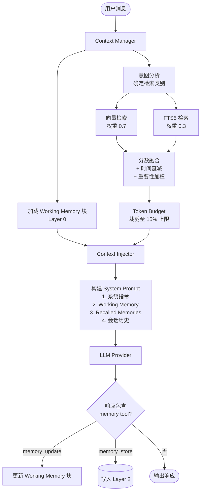
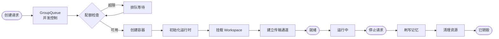
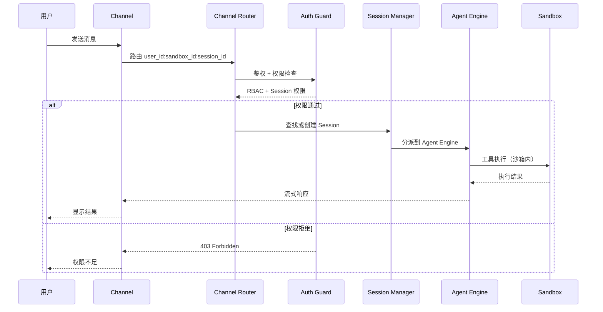
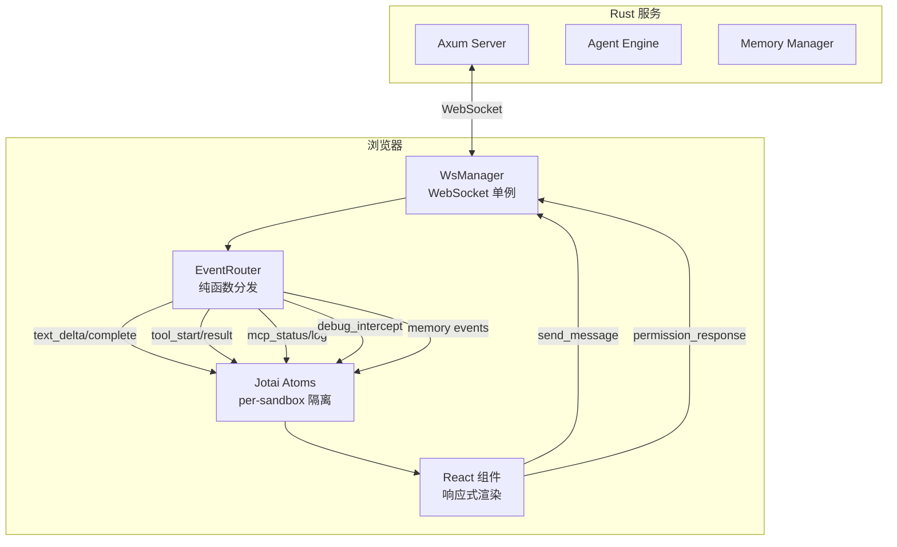
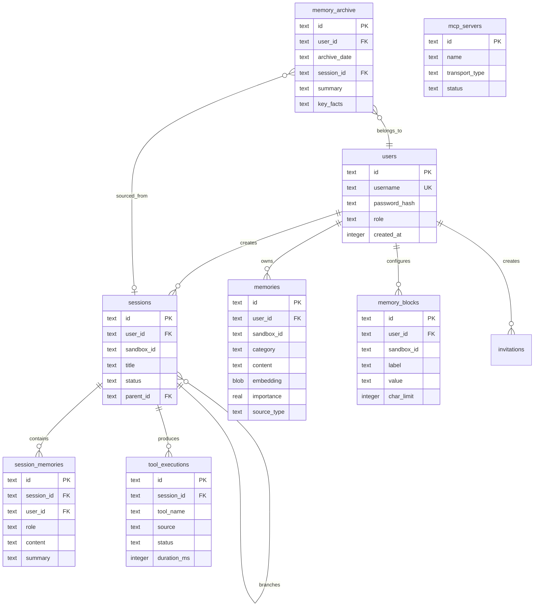
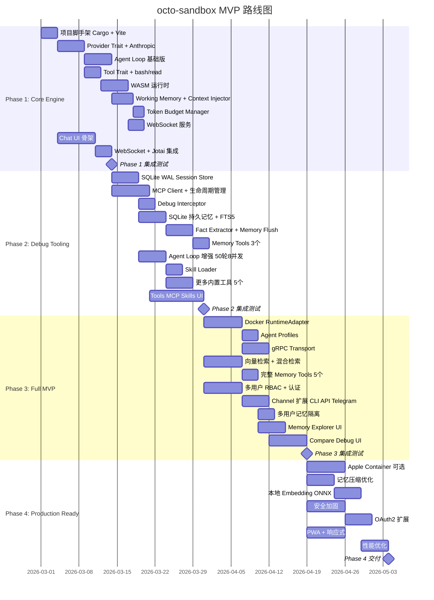

# octo-sandbox 架构设计文档

**版本**: v1.0
**创建日期**: 2026-02-26
**状态**: 正式规范

---

## 变更记录

| 版本 | 日期 | 变更说明 |
|------|------|---------|
| v1.0 | 2026-02-26 | 初始版本，整合 8 段架构设计 brainstorming |

---

## 目录

- [第一章：项目概述与定位](#第一章项目概述与定位)
- [第二章：系统架构总览](#第二章系统架构总览)
- [第三章：Agent Engine 内部架构](#第三章agent-engine-内部架构)
- [第四章：记忆系统架构](#第四章记忆系统架构)
- [第五章：沙箱管理器与容器隔离](#第五章沙箱管理器与容器隔离)
- [第六章：外部渠道与多用户体系](#第六章外部渠道与多用户体系)
- [第七章：工具调试面板](#第七章工具调试面板)
- [第八章：Web UI 架构](#第八章web-ui-架构)
- [第九章：数据模型与存储设计](#第九章数据模型与存储设计)
- [第十章：接口定义汇总](#第十章接口定义汇总)
- [第十一章：技术决策日志](#第十一章技术决策日志)
- [第十二章：MVP 分阶段路线图](#第十二章mvp-分阶段路线图)
- [附录](#附录)

---

# 第一章：项目概述与定位

## 1.1 项目愿景

octo-sandbox 是一个**企业级自主智能体工具模块（Skills/MCP/CLI）安全沙箱调试环境**。核心理念是将主流顶级自主智能体（Claude Code、OpenClaw 等）圈养在沙箱中，提供安全可控的工具开发调试环境。

### 核心价值

1. **安全隔离**：在受控沙箱中运行自主智能体，防止未经授权的系统访问
2. **工具调试**：提供完整的 MCP/Skills/CLI 工具开发调试工作台
3. **多智能体管理**：统一管理多种智能体（自有 Rust 智能体 + 被圈养的 CC/OpenClaw）
4. **跨会话记忆**：基于上下文工程最佳实践的四层记忆系统
5. **企业就绪**：多用户 RBAC、审计日志、可控权限模型

## 1.2 参考项目分析矩阵

对 `./github.com/` 下 14+ 个参考项目进行了深度代码分析：

### 智能体框架与平台

| 项目 | 语言 | 核心定位 | 关键可复用点 |
|------|------|---------|------------|
| pi-mono | TypeScript | 核心智能体框架 | Agent Loop、Tool 系统、Skill 加载、25+ LLM Provider |
| pi_agent_rust | Rust | pi-mono 的 Rust 重写（225K 行） | Provider Trait、Tool Trait、QuickJS 扩展、安全模型 |
| pi-skills | Markdown+JS | 技能定义库 | SKILL.md 格式、`{baseDir}` 模板、跨智能体兼容 |
| OpenClaw | TypeScript | 完整 AI 助手平台 | Gateway 架构、20+ 渠道、Plugin 系统、沙箱隔离 |
| nanoclaw | TypeScript | 最简 OpenClaw 替代 | 容器隔离、IPC 协议、Cursor 恢复 |
| happyclaw | TypeScript | 企业级多用户服务器 | RBAC、Docker+Host 双模式、飞书/Telegram、Web 终端 |
| craft-agents-oss | TS/React | 专业桌面 UI | shadcn/ui、多会话 Inbox、Diff 视图、MCP 集成 |
| zeroclaw | Rust | 超轻量 CLI 智能体 | Trait 插件系统、22+ Provider、混合搜索、<5MB |

### 记忆系统专项

| 项目 | 语言 | 存储后端 | 检索方式 | 核心亮点 |
|------|------|---------|---------|---------|
| mem0 | Python | 28+ 向量库 + Neo4j 图谱 | 向量 + 图谱双路并发 | LLM 驱动事实提取，ADD/UPDATE/DELETE 决策 |
| Letta (MemGPT) | Python | pgvector/Turbopuffer | 自编辑 memory tools | Agent 自主修改核心记忆块，Memory.compile() |
| OpenViking | Rust+Python+C++ | 自研 C++ VectorDB | 分层意图检索 + 目录递归 | L0/L1/L2 三级精度，viking:// URI 协议 |
| agent-file | 多语言 | JSON 文件 | 工具调用 | .af 跨平台序列化格式 |
| memos | Go | SQLite/MySQL/PostgreSQL | 全文搜索 | Protobuf API，插件系统 |
| Agent-Skills-CE | Markdown | — | — | 上下文工程最佳实践，五大退化模式，三大压缩策略 |

## 1.3 核心功能域

octo-sandbox 覆盖以下七大功能域：

1. **Agent Engine** — 自有 Rust 智能体引擎（Agent Loop / Provider / Tool / Skill）
2. **Sandbox Manager** — 沙箱容器调度（WASM / Docker / Apple Container）
3. **Memory Manager** — 四层记忆系统（Working / Session / Persistent / Archive）
4. **Channel Router** — 多渠道消息路由（Web / CLI / API / Telegram）
5. **Debug Panel** — 工具调试面板（六大功能模块）
6. **Auth & RBAC** — 多用户认证与权限控制
7. **Web UI** — React 19 现代 Web 界面

---

# 第二章：系统架构总览

## 2.1 三层架构

系统采用经典三层架构：

```
Web UI (React 19) → Rust 核心服务 (octo-engine) → 沙箱运行时
```

- **表现层**：React 19 + Vite 6 + shadcn/ui，通过 WebSocket 与核心服务通信
- **核心服务层**：Rust + Axum，包含 Agent Engine、Memory Manager、Channel Router 等核心组件
- **运行时层**：WASM / Docker / Apple Container，提供工具执行的安全沙箱环境

## 2.2 系统分层架构图



## 2.3 七大核心组件

| 组件 | 职责 | 关键 Trait |
|------|------|-----------|
| **Agent Engine** | 自主智能体引擎：Agent Loop、LLM 调用、工具编排、上下文管理 | `Provider`, `Tool` |
| **Sandbox Manager** | 容器生命周期管理、运行时适配、通信传输、安全策略 | `RuntimeAdapter`, `Transport` |
| **Memory Manager** | 四层记忆管理、混合检索、事实提取、上下文注入、Token 预算 | `MemoryStore`, `WorkingMemory` |
| **Channel Router** | 多渠道消息接入、路由分发、协议适配 | `Channel` |
| **Tool Registry** | 工具注册发现、策略引擎、MCP 工具代理、Skill 加载 | — |
| **Session Store** | 会话持久化（SQLite WAL + JSONL）、分支管理、FTS5 全文检索 | — |
| **Auth & RBAC** | 用户认证、三角色权限、双层权限模型、审计日志 | — |

## 2.4 核心组件关系图



### 数据流说明

1. **用户请求流**：Channel Router → Auth Guard → Agent Engine → Tool Registry → Sandbox Manager → 运行时
2. **记忆流**：Agent Engine ↔ Memory Manager ↔ SQLite WAL
3. **会话流**：Agent Engine ↔ Session Store ↔ SQLite WAL
4. **控制流**：Sandbox Manager → RuntimeAdapter → Transport → 容器进程

---

# 第三章：Agent Engine 内部架构

## 3.1 设计定位

Rust 在本项目中承担**双重角色**：

- **独立自主智能体**：自有 Agent Loop / Tool / Provider（参考 pi_agent_rust + zeroclaw）
- **沙箱调度器**：管理 CC/OpenClaw 等被圈养的智能体容器

这一决策带来约 20-30% 的额外工作量，但获得了自举测试能力、不依赖外部智能体即可运行、多 LLM 灵活性等关键优势。

## 3.2 Agent Loop 生命周期

Agent Loop 参考 pi_agent_rust 设计，支持最大 **50 轮**迭代、**8 并发**工具执行：

1. **初始化**：构建 System Prompt（含 Working Memory 注入、相关记忆检索）
2. **迭代循环**：LLM 调用 → 解析响应 → 工具执行 → 结果反馈 → 再次 LLM 调用
3. **终止条件**：Agent 输出最终回复、达到最大轮数、用户取消、Token 预算耗尽
4. **后处理**：事实提取（异步）、会话持久化、记忆更新

## 3.3 Agent Engine 内部流程图



## 3.4 Provider Trait

Provider Trait 定义 LLM 调用接口，MVP 先支持 Anthropic + OpenAI + Gemini：

```rust
/// LLM Provider 统一接口
///
/// 所有 LLM 提供商（Anthropic、OpenAI、Gemini 等）实现此 Trait，
/// 对 Agent Loop 提供透明的模型调用能力。
#[async_trait]
pub trait Provider: Send + Sync {
    /// 提供商唯一标识（如 "anthropic", "openai"）
    fn id(&self) -> &str;

    /// 发送消息并获取完整响应
    async fn complete(&self, request: CompletionRequest) -> Result<CompletionResponse>;

    /// 发送消息并获取流式响应
    async fn stream(&self, request: CompletionRequest) -> Result<CompletionStream>;

    /// 生成文本向量嵌入
    async fn embed(&self, texts: &[&str]) -> Result<Vec<Vec<f32>>>;

    /// 列出可用模型
    async fn list_models(&self) -> Result<Vec<ModelInfo>>;
}
```

## 3.5 Tool Trait

统一的工具接口，覆盖内置工具和 MCP 动态工具：

```rust
/// 工具统一接口
///
/// 所有工具（内置 + MCP + Skill）实现此 Trait，
/// 对 Agent Loop 透明，统一执行和结果格式。
#[async_trait]
pub trait Tool: Send + Sync {
    /// 工具唯一名称
    fn name(&self) -> &str;

    /// 工具描述（供 LLM 理解）
    fn description(&self) -> &str;

    /// JSON Schema 参数定义
    fn parameters(&self) -> serde_json::Value;

    /// 执行工具
    async fn execute(
        &self,
        params: serde_json::Value,
        ctx: &ToolContext,
    ) -> Result<ToolResult>;

    /// 工具来源类型
    fn source(&self) -> ToolSource;
}

/// 工具来源
pub enum ToolSource {
    BuiltIn,       // 内置工具（bash, read, write, edit, grep, glob, find）
    Mcp(String),   // MCP Server 动态工具
    Skill(String), // SKILL.md 定义的工具
}
```

**内置工具清单**：

| 工具 | Phase | 功能 |
|------|-------|------|
| `bash` | Phase 1 | 执行 shell 命令 |
| `read` | Phase 1 | 读取文件内容 |
| `write` | Phase 2 | 写入文件 |
| `edit` | Phase 2 | 编辑文件（精确替换） |
| `grep` | Phase 2 | 内容搜索 |
| `glob` | Phase 2 | 文件模式匹配 |
| `find` | Phase 2 | 文件查找 |

## 3.6 Skill Loader

直接解析标准 SKILL.md 格式（YAML frontmatter + Markdown），与 CC/pi-mono 共用同一 Skill 生态：

- 解析 YAML frontmatter 提取工具定义（名称、参数、描述）
- 支持 `{baseDir}` 等模板变量
- 兼容性验证（检查 CC/pi-mono 解析规范）

## 3.7 Context Manager

Context Manager 负责构建和管理 Agent 的上下文窗口：

- **System Prompt 构建**：集成 Working Memory 注入、Skill 定义、工具声明
- **上下文压缩/摘要**：当 Token 使用率超过 80% 时触发三阶段压缩（详见第 4.7 节）
- **Session 分支**：支持对话分支管理
- **Memory 集成**：协调 Memory Manager 完成记忆检索和注入（详见第 4.6 节）

## 3.8 Agent Memory Tools

为 Agent 提供 5 个记忆工具，实现自编辑记忆能力（参考 Letta 设计理念）：

| 工具名 | 功能 | 参考来源 | Phase |
|--------|------|---------|-------|
| `memory_store` | 显式存储一条记忆到持久层 | mem0 add / Letta archival_memory_insert | Phase 2 |
| `memory_search` | 搜索持久记忆（混合检索） | openclaw memory_search / Letta archival_memory_search | Phase 2 |
| `memory_update` | 更新 Working Memory 块 | Letta core_memory_replace | Phase 2 |
| `memory_recall` | 搜索会话历史 | Letta conversation_search | Phase 3 |
| `memory_forget` | 删除/过期指定记忆 | zeroclaw forget | Phase 3 |

**设计要点**：
- Agent 可通过 `memory_update` 自主修改 Working Memory（如更新对用户的理解）
- 事实提取在后台自动进行，不作为 Agent 工具暴露
- `memory_search` 默认使用混合检索，对 Agent 透明

---

# 第四章：记忆系统架构

记忆系统是 octo-sandbox 的核心创新模块，综合 mem0、Letta、OpenViking、openclaw 等项目的最佳实践，构建面向沙箱调试场景的四层记忆架构。

## 4.1 总体架构

Memory Manager 包含 **6 个核心组件**：



| 组件 | 职责 |
|------|------|
| **Memory Store** | 持久化层，管理 SQLite WAL 中的记忆 CRUD 操作 |
| **Memory Retriever** | 检索层，执行混合检索（向量 0.7 + FTS 0.3）、时间衰减、重要性加权 |
| **Context Injector** | 注入层，将 Working Memory 和检索结果结构化注入到 System Prompt |
| **Fact Extractor** | 事实提取器，LLM 驱动从对话中提取结构化事实 |
| **Memory Compressor** | 记忆压缩器，执行三阶段压缩（刷写 → 消息压缩 → 归档） |
| **Token Budget Manager** | 预算管理器，管理上下文窗口中各部分的 Token 分配 |

## 4.2 四层记忆体系

采用 **Letta 三层 + OpenViking 精度分级 + 归档层** 的混合设计：

### Layer 0: Working Memory（工作记忆）

**特征**：始终在上下文窗口内，约 4K tokens

Working Memory 由结构化的 **记忆块（Memory Block）** 组成：

| 记忆块 | 内容 | 更新方式 |
|--------|------|---------|
| `sandbox_context` | 当前沙箱配置、运行时状态 | 系统自动更新 |
| `user_profile` | 用户偏好、技能水平、常用工具 | Agent 自编辑 |
| `agent_persona` | Agent 人设和行为规则 | 配置文件 |
| `task_context` | 当前任务上下文、关键决策 | Agent 自编辑 |

### Layer 1: Session Memory（会话记忆）

**特征**：短期记忆，受上下文窗口限制

- 本次会话的完整消息历史 + 工具执行记录
- 最近 N 条消息保留原文（STATIC_BUFFER = 10）
- 较早消息自动摘要压缩
- 工具执行结果保留结构化摘要
- 存储：内存 + SQLite（会话结束后持久化）

### Layer 2: Persistent Memory（持久记忆）

**特征**：跨会话持久化的结构化知识

记忆分为 **5 个类别**（简化 OpenViking 6 类）：

| 类别 | 说明 | 示例 |
|------|------|------|
| `profile` | 用户身份和背景 | "用户是 Rust 开发者，3 年经验" |
| `preferences` | 使用偏好和习惯 | "偏好 Docker 运行模式，使用 vim 编辑" |
| `tools` | 工具使用知识 | "MCP Server X 需要先配置 API Key" |
| `debug` | 调试经验和解决方案 | "WASM 运行时内存限制需设为 256MB" |
| `patterns` | 工作模式和最佳实践 | "该用户习惯先测试再提交" |

- 存储：SQLite WAL（向量索引 + FTS5 全文索引）
- 检索：混合检索（向量 0.7 + FTS 0.3 权重）

### Layer 3: Archive Memory（归档记忆）

**特征**：冷存储，仅在显式搜索时加载

- 已结束会话的压缩摘要
- 历史工具执行日志（结构化）
- 日期分区的时序记忆
- 存储：SQLite archive 表 / JSONL 导出

## 4.3 Memory Store（持久化层）

### 完整 SQLite Schema

```sql
-- ============================================================
-- 表 1: memories — 核心记忆表（Layer 2 持久记忆）
-- ============================================================
CREATE TABLE memories (
    id           TEXT PRIMARY KEY,       -- ULID（时间有序）
    user_id      TEXT NOT NULL,          -- 所属用户
    sandbox_id   TEXT,                   -- 关联沙箱（NULL = 全局记忆）
    category     TEXT NOT NULL,          -- profile/preferences/tools/debug/patterns
    content      TEXT NOT NULL,          -- 记忆内容（纯文本）
    metadata     TEXT,                   -- JSON 元数据（来源、置信度等）
    embedding    BLOB,                   -- 向量嵌入（f32 数组序列化）
    created_at   INTEGER NOT NULL,       -- Unix timestamp
    updated_at   INTEGER NOT NULL,
    accessed_at  INTEGER NOT NULL,       -- 最后访问时间（用于衰减）
    access_count INTEGER DEFAULT 0,      -- 访问次数
    importance   REAL DEFAULT 0.5,       -- 重要性评分 0.0-1.0
    ttl          INTEGER,               -- 可选过期时间（Unix timestamp）
    source_type  TEXT NOT NULL,          -- extracted/manual/system
    source_ref   TEXT                    -- 来源引用（session_id/tool_execution_id）
);

-- ============================================================
-- 表 2: memories_fts — FTS5 全文索引
-- ============================================================
CREATE VIRTUAL TABLE memories_fts USING fts5(
    content,
    category,
    content=memories,
    content_rowid=rowid,
    tokenize='porter unicode61'
);

-- ============================================================
-- 表 3: session_memories — 会话记忆表（Layer 1 持久化部分）
-- ============================================================
CREATE TABLE session_memories (
    id           TEXT PRIMARY KEY,
    session_id   TEXT NOT NULL,
    user_id      TEXT NOT NULL,
    role         TEXT NOT NULL,          -- user/assistant/system/tool
    content      TEXT NOT NULL,
    summary      TEXT,                   -- 压缩后的摘要
    tool_calls   TEXT,                   -- JSON: 关联的工具调用
    token_count  INTEGER,
    created_at   INTEGER NOT NULL,
    is_pinned    INTEGER DEFAULT 0       -- 固定不被压缩
);

-- ============================================================
-- 表 4: memory_archive — 归档表（Layer 3）
-- ============================================================
CREATE TABLE memory_archive (
    id           TEXT PRIMARY KEY,
    user_id      TEXT NOT NULL,
    archive_date TEXT NOT NULL,          -- YYYY-MM-DD 日期分区
    session_id   TEXT,
    summary      TEXT NOT NULL,          -- 压缩摘要
    key_facts    TEXT,                   -- JSON: 关键事实列表
    metadata     TEXT,
    created_at   INTEGER NOT NULL
);

-- ============================================================
-- 表 5: memory_blocks — Working Memory 块定义表
-- ============================================================
CREATE TABLE memory_blocks (
    id           TEXT PRIMARY KEY,
    user_id      TEXT NOT NULL,
    sandbox_id   TEXT,
    label        TEXT NOT NULL,          -- sandbox_context/user_profile/agent_persona/task_context
    value        TEXT NOT NULL DEFAULT '',
    char_limit   INTEGER NOT NULL DEFAULT 2000,
    is_readonly  INTEGER DEFAULT 0,
    updated_at   INTEGER NOT NULL
);
```

## 4.4 Memory Retriever（检索层）

### 混合检索策略

参考 openclaw 实践验证的 0.7/0.3 权重比例 + OpenViking 分层检索：

```
查询请求
  |
  +-- 1. 意图分析（轻量 LLM 调用或规则匹配）
  |     -> 确定查询类别 + 目标记忆层
  |
  +-- 2. 向量检索（语义相似度）
  |     -> embedding(query) -> cosine_similarity -> top-K
  |     -> 权重: 0.7
  |
  +-- 3. FTS5 检索（关键词匹配）
  |     -> BM25 评分
  |     -> 权重: 0.3
  |
  +-- 4. 分数融合 + 时间衰减
  |     -> score = 0.7 * vec_score + 0.3 * fts_score
  |     -> score *= time_decay(accessed_at)
  |     -> score *= importance
  |
  +-- 5. 结果排序 + Token 预算裁剪
        -> 按分数排序 -> 按 token budget 截断 -> 返回结构化结果
```

### 渐进式精度加载

同一知识以不同精度级别存储，按需加载（参考 OpenViking L0/L1/L2）：

```rust
/// 记忆精度级别
///
/// 控制检索返回的记忆详细程度，优化 Token 使用效率。
pub enum MemoryPrecision {
    /// ~100 tokens — 用于 System Prompt 中的概要
    Abstract,
    /// ~500 tokens — 用于检索结果的摘要展示
    Summary,
    /// 完整内容 — 用于用户显式请求查看详情
    Full,
}
```

**应用场景**：
- L0（Abstract）：System Prompt 中的用户画像概要 → "Rust 开发者，偏好 Docker 模式"
- L1（Summary）：检索结果摘要 → 用户配置详情、常用命令列表
- L2（Full）：显式查看详情 → 完整对话记录、配置文件全文

## 4.5 Fact Extractor（事实提取器）

### LLM 驱动事实提取流程

参考 mem0 的 LLM 驱动提取模式，Rust 原生实现：

```
对话消息（用户/助手）
  |
  +-- 1. 触发条件判断
  |     - 每 N 轮对话自动触发（默认 5 轮）
  |     - 用户显式提到偏好/配置时立即触发
  |     - 会话结束/压缩前强制触发
  |
  +-- 2. 事实提取（调用 LLM Provider）
  |     - 输入：最近对话 + 提取提示词
  |     - 输出：结构化事实列表 JSON
  |
  +-- 3. 去重与合并（对比现有记忆）
  |     - 向量相似度 > 0.85 视为重复
  |     - LLM 判断：ADD / UPDATE / DELETE / NONE
  |
  +-- 4. 写入持久存储
        - 生成 embedding -> 写入 memories 表 -> 更新 FTS5 索引
```

### 提取提示词设计

```text
你是一个记忆提取器。分析以下对话，提取值得长期记住的事实。

规则：
1. 只提取明确的事实，不推测
2. 偏好、配置、经验最重要
3. 一次性的临时信息忽略
4. 每条事实独立且自包含
5. 标注类别和重要性

输出 JSON 数组：
[{"fact": "...", "category": "profile|preferences|tools|debug|patterns", "importance": 0.0-1.0}]
```

## 4.6 Context Injector（上下文注入器）

### 结构化注入策略

遵循上下文工程最佳实践（参考 Agent-Skills-for-Context-Engineering）：

```text
构建 System Prompt
  |
  +-- 1. 基础层（始终存在）
  |     [SYSTEM INSTRUCTIONS]
  |     核心系统指令
  |
  +-- 2. Working Memory 注入（Layer 0）
  |     [MEMORY: sandbox_context]
  |     当前沙箱: Docker 模式, Python 3.12, MCP Server: filesystem
  |     [/MEMORY]
  |     [MEMORY: user_profile]
  |     用户偏好: Rust 开发者, 偏好 vim, 习惯先测试再提交
  |     [/MEMORY]
  |
  +-- 3. 相关记忆注入（Layer 2 检索结果）
  |     [RECALLED MEMORIES]
  |     - 该 MCP Server 需要先设置 ANTHROPIC_API_KEY 环境变量 [tools, 0.92]
  |     - Docker 运行时需要挂载 /workspace 目录 [debug, 0.87]
  |     [/RECALLED MEMORIES]
  |
  +-- 4. 会话历史（Layer 1）
        [CONVERSATION HISTORY]
        最近消息...
        [/CONVERSATION HISTORY]
```

### 反退化设计原则

| 原则 | 应对退化模式 | 实现方式 |
|------|-------------|---------|
| 关键记忆前置 | Lost-in-the-Middle | Working Memory 紧跟系统指令 |
| 结构化标签 | Context Distraction | 使用 `[MEMORY]` / `[RECALLED MEMORIES]` 标签 |
| 注入前去重 | Context Distraction | 检查与当前对话是否重复 |
| 矛盾检测 | Context Confusion | 检测矛盾记忆，优先最新 |
| 来源分离 | Context Clash | 记忆和系统指令明确分离 |
| Token 硬限制 | Context Poisoning | 记忆注入不超过总上下文的 15% |

## 4.7 Token Budget Manager 与 Memory Compressor

### Token Budget Manager

参考 Letta 的 ContextWindowCalculator，Rust 原生实现：

```rust
/// Token 预算分配
///
/// 管理上下文窗口中各部分的 Token 占比，确保记忆、工具定义、
/// 会话历史之间的平衡分配。
pub struct TokenBudget {
    /// 总上下文窗口大小（如 200K）
    pub total_limit: usize,
    /// 系统提示词预算（~10K）
    pub system_prompt_budget: usize,
    /// 记忆注入预算（总量的 15%）
    pub memory_budget: usize,
    /// 工具定义预算
    pub tool_defs_budget: usize,
    /// 会话历史预算（剩余空间）
    pub history_budget: usize,
    /// 预留空间（输出 + 安全边际，~16K）
    pub reserve: usize,
}
```

**分配策略**：
1. 固定分配：system_prompt + tool_defs + reserve
2. 弹性分配：memory + history 共享剩余空间
3. 记忆优先：先分配 memory_budget（上限 15%），剩余给 history

### Memory Compressor — 三阶段压缩流程

当上下文使用率超过 80% 时触发（参考 Letta + openclaw + pi_agent_rust）：

```
上下文接近限制（使用率超过 80%）
  |
  +-- Stage 1: 记忆刷写（Memory Flush）—— 最重要！
  |     - 提取本轮对话中的新事实 -> 写入 Layer 2
  |     - 保存当前 Working Memory 块状态
  |     - 此步骤必须在压缩前完成
  |
  +-- Stage 2: 消息压缩（Message Compaction）
  |     - 保留最近 N 条消息不压缩（STATIC_BUFFER = 10）
  |     - 较早消息进行锚定迭代压缩（质量评分 3.70/5，最佳策略）
  |     - 压缩摘要注入到消息历史开头
  |     - 工具调用结果压缩为结构化摘要
  |
  +-- Stage 3: 归档（Archive）
        - 压缩后的完整会话摘要 -> Layer 3 归档
        - 更新日期分区索引
```

## 4.8 Memory Trait 定义

```rust
/// 核心记忆存储 Trait — 统一持久化接口
///
/// 所有记忆后端（SQLite、内存 Mock 等）实现此 Trait，
/// 提供记忆的 CRUD 和混合检索能力。
#[async_trait]
pub trait MemoryStore: Send + Sync {
    /// 存储新记忆
    async fn store(&self, entry: MemoryEntry) -> Result<MemoryId>;

    /// 混合检索（向量 + FTS）
    async fn search(&self, query: &str, opts: SearchOptions) -> Result<Vec<MemoryResult>>;

    /// 按 ID 获取单条记忆
    async fn get(&self, id: &MemoryId) -> Result<Option<MemoryEntry>>;

    /// 更新记忆内容
    async fn update(&self, id: &MemoryId, content: &str) -> Result<()>;

    /// 删除记忆
    async fn delete(&self, id: &MemoryId) -> Result<()>;

    /// 按过滤条件列出记忆
    async fn list(&self, filter: MemoryFilter) -> Result<Vec<MemoryEntry>>;

    /// 批量写入（事实提取后批量存储）
    async fn batch_store(&self, entries: Vec<MemoryEntry>) -> Result<Vec<MemoryId>>;
}

/// 检索选项
pub struct SearchOptions {
    pub user_id: UserId,
    pub sandbox_id: Option<SandboxId>,
    /// 过滤类别（profile/preferences/tools/debug/patterns）
    pub categories: Vec<MemoryCategory>,
    /// 返回精度（Abstract/Summary/Full）
    pub precision: MemoryPrecision,
    /// 最大返回数
    pub limit: usize,
    /// Token 预算限制
    pub token_budget: usize,
    /// 最低相关性阈值
    pub min_score: f32,
    /// 是否启用时间衰减
    pub time_decay: bool,
}

/// 记忆条目
pub struct MemoryEntry {
    pub id: MemoryId,
    pub user_id: UserId,
    pub sandbox_id: Option<SandboxId>,
    pub category: MemoryCategory,
    pub content: String,
    /// L0/L1 摘要（用于渐进式精度加载）
    pub summary: Option<String>,
    pub metadata: serde_json::Value,
    pub embedding: Option<Vec<f32>>,
    pub importance: f32,
    pub source: MemorySource,
    pub timestamps: MemoryTimestamps,
}

/// Working Memory 块管理 Trait
///
/// 管理 Agent 的工作记忆块，支持 Agent 自编辑和
/// System Prompt 编译输出。
#[async_trait]
pub trait WorkingMemory: Send + Sync {
    /// 获取所有活跃记忆块
    async fn get_blocks(
        &self,
        user_id: &UserId,
        sandbox_id: &SandboxId,
    ) -> Result<Vec<MemoryBlock>>;

    /// 更新记忆块内容（Agent 自编辑）
    async fn update_block(&self, block_id: &str, value: &str) -> Result<()>;

    /// 追加内容到记忆块
    async fn append_block(&self, block_id: &str, content: &str) -> Result<()>;

    /// 编译为 System Prompt 片段
    async fn compile(
        &self,
        user_id: &UserId,
        sandbox_id: &SandboxId,
    ) -> Result<String>;
}
```

## 4.9 Embedding 策略

### Phase 1（MVP，零外部依赖）

- 使用 LLM Provider 的 embedding API（Anthropic 使用 Voyage AI，OpenAI 使用 text-embedding-3-small）
- 向量维度：1024（Voyage）或 1536（OpenAI）
- 缓存策略：SQLite 存储 embedding，避免重复计算
- 分块：400 tokens/chunk，80 tokens overlap（参考 openclaw）

### Phase 2（可选优化）

- 本地 embedding 模型（ONNX Runtime，如 all-MiniLM-L6-v2）
- 混合 embedding：dense + sparse（参考 OpenViking）
- sqlite-vec 扩展加速向量检索

### 余弦相似度实现（Phase 1 纯 Rust，无外部库）

```rust
fn cosine_similarity(a: &[f32], b: &[f32]) -> f32 {
    let dot: f32 = a.iter().zip(b.iter()).map(|(x, y)| x * y).sum();
    let norm_a: f32 = a.iter().map(|x| x * x).sum::<f32>().sqrt();
    let norm_b: f32 = b.iter().map(|x| x * x).sum::<f32>().sqrt();
    if norm_a == 0.0 || norm_b == 0.0 {
        return 0.0;
    }
    dot / (norm_a * norm_b)
}
```

## 4.10 记忆检索与注入流程图



## 4.11 上下文工程反退化检查清单

| 检查项 | 目标 |
|--------|------|
| Working Memory 放在 System Prompt 开头 | 避免 Lost-in-the-Middle |
| 检索结果用 `[RECALLED MEMORIES]` 标签包裹 | 模型区分记忆来源 |
| 注入前去重过滤 | 避免 Context Distraction |
| 矛盾记忆检测，保留最新 | 避免 Context Confusion |
| 记忆和系统指令分离 | 避免 Context Clash |
| Token 预算硬限制（15%） | 防止记忆溢出挤占对话空间 |
| 定期记忆清理（重要性衰减） | 保持记忆库质量 |

---

# 第五章：沙箱管理器与容器隔离

## 5.1 RuntimeAdapter Trait

沙箱管理器通过 RuntimeAdapter Trait 抽象三种运行时：

```rust
/// 运行时适配器 — 统一沙箱运行时接口
///
/// 抽象 WASM、Docker、Apple Container 三种运行时，
/// 对上层 Sandbox Manager 提供统一的容器生命周期管理。
#[async_trait]
pub trait RuntimeAdapter: Send + Sync {
    /// 运行时类型标识
    fn runtime_type(&self) -> RuntimeType;

    /// 创建沙箱实例
    async fn create(&self, config: SandboxConfig) -> Result<SandboxId>;

    /// 启动沙箱
    async fn start(&self, id: &SandboxId) -> Result<()>;

    /// 停止沙箱
    async fn stop(&self, id: &SandboxId) -> Result<()>;

    /// 销毁沙箱
    async fn destroy(&self, id: &SandboxId) -> Result<()>;

    /// 获取沙箱状态
    async fn status(&self, id: &SandboxId) -> Result<SandboxStatus>;

    /// 在沙箱中执行命令
    async fn execute(&self, id: &SandboxId, cmd: &str) -> Result<ExecResult>;

    /// 获取传输通道
    async fn transport(&self, id: &SandboxId) -> Result<Box<dyn Transport>>;
}

/// 运行时类型
pub enum RuntimeType {
    Wasm,           // wasmtime — 轻量工具沙箱，毫秒级启动
    Docker,         // Docker — 完整智能体运行时（CC/OpenClaw）
    AppleContainer, // macOS 原生容器（可选）
}
```

**运行时优先级与适用场景**：

| 运行时 | 优先级 | 适用场景 | 启动速度 |
|--------|--------|---------|---------|
| WASM (wasmtime) | Phase 1 | 轻量工具沙箱 | 毫秒级 |
| Docker | Phase 3 | 完整智能体（CC/OpenClaw） | 秒级 |
| Apple Container | Phase 4 | macOS 优化（可选） | 亚秒级 |

## 5.2 Transport Trait

四种通信传输通道：

```rust
/// 传输通道 — 统一通信接口
///
/// 抽象 Sandbox Manager 与沙箱运行时之间的通信协议，
/// 支持 MCP 标准、高性能 gRPC、WASM 宿主调用等模式。
#[async_trait]
pub trait Transport: Send + Sync {
    /// 传输类型标识
    fn transport_type(&self) -> TransportType;

    /// 发送请求并等待响应
    async fn request(&self, req: TransportRequest) -> Result<TransportResponse>;

    /// 发送请求并获取流式响应
    async fn stream(&self, req: TransportRequest) -> Result<TransportStream>;

    /// 健康检查
    async fn health_check(&self) -> Result<bool>;

    /// 关闭传输通道
    async fn close(&self) -> Result<()>;
}

/// 传输类型
pub enum TransportType {
    McpStdio,     // MCP 标准 stdio 传输（所有运行时通用）
    Grpc,         // gRPC/tonic 高性能控制通道（Docker/VM，双向流）
    WasmHostcall, // WASM 宿主函数调用（零开销）
    UnixSocket,   // 同主机低延迟备选
}
```

## 5.3 Container Lifecycle 与 GroupQueue 并发控制

参考 happyclaw 的并发模型（20 容器 + 5 本地进程）：



**并发配额**（可配置）：
- WASM 容器：上限 50（轻量级）
- Docker 容器：上限 20
- 本地进程：上限 5
- 支持 Session 级队列调度、指数退避重试

## 5.4 Mount Security（挂载安全）

| 策略 | 说明 |
|------|------|
| **白名单验证** | 仅允许挂载 `data/users/{user_id}/workspace/` 等授权路径 |
| **系统路径黑名单** | 禁止挂载 `/etc`, `/usr`, `/var`, `/sys`, `/proc`, `/dev` 等 14 个系统目录 |
| **Symlink 遍历防护** | 通过 canonicalization + resolved-path 验证阻止符号链接逃逸 |
| **非管理员 Read-Only** | Viewer 角色仅可读挂载，Developer 可读写自己的 workspace |
| **敏感文件黑名单** | 禁止挂载 `.env`, `.ssh`, `.aws`, `.gnupg` 等 4 类敏感 dotfiles |

## 5.5 Agent Profiles

配置化管理不同智能体类型，新增类型只需新增 profile：

| Profile | 运行时 | 传输 | 用途 |
|---------|--------|------|------|
| `rust-native` | WASM/Docker | MCP stdio | 自有 Rust 智能体 |
| `claude-code` | Docker | MCP stdio + gRPC | Claude Code 圈养 |
| `openclaw` | Docker | MCP stdio + gRPC | OpenClaw 圈养 |
| `custom` | 用户配置 | 用户配置 | 自定义智能体 |

## 5.6 Debug Interceptor

可选开启的请求/响应记录层，用于调试审计：

- 拦截所有 Transport 请求/响应
- 写入 JSON 文件（带时间戳和请求 ID）
- 支持实时流推送到 Web UI Debug 面板
- 对性能影响可控（仅在开启时产生 I/O 开销）

---

# 第六章：外部渠道与多用户体系

## 6.1 Channel Trait

简洁路线设计（参考 zeroclaw + openclaw capabilities），不走 openclaw 15 adapter 路线：

```rust
/// 渠道统一接口
///
/// 所有消息渠道（Web、CLI、API、Telegram 等）实现此 Trait，
/// 通过 ChannelCapabilities 声明各渠道的能力差异。
#[async_trait]
pub trait Channel: Send + Sync {
    /// 渠道唯一标识
    fn id(&self) -> &str;

    /// 声明渠道能力
    fn capabilities(&self) -> ChannelCapabilities;

    /// 发送消息
    async fn send(&self, msg: ChannelMessage) -> Result<()>;

    /// 发送流式消息
    async fn send_stream(&self, stream: MessageStream) -> Result<()>;

    /// 监听消息（返回消息流）
    async fn listen(&self) -> Result<MessageReceiver>;

    /// 请求用户权限确认
    async fn request_permission(
        &self,
        req: PermissionRequest,
    ) -> Result<PermissionResponse>;

    /// 健康检查
    async fn health_check(&self) -> Result<bool>;
}

/// 渠道能力声明
pub struct ChannelCapabilities {
    pub streaming: bool,      // 支持流式输出
    pub rich_text: bool,      // 支持富文本/Markdown
    pub file_upload: bool,    // 支持文件上传
    pub interactive: bool,    // 支持交互确认
    pub bidirectional: bool,  // 支持双向通信
}

/// 消息内容类型
pub enum MessageContent {
    Text(String),                      // 纯文本/Markdown
    Command(CommandPayload),           // 结构化命令
    File(FilePayload),                 // 文件内容
    Structured(serde_json::Value),     // 结构化数据（JSON）
}
```

## 6.2 MVP 四渠道能力矩阵

| 渠道 | streaming | rich_text | file_upload | interactive | bidirectional | Phase |
|------|-----------|-----------|-------------|-------------|---------------|-------|
| **WebChannel** | Yes | Yes | Yes | Yes | Yes | Phase 1 |
| **CliChannel** | Yes | No | No | Yes | Yes | Phase 3 |
| **ApiChannel** | Yes | Yes | Yes | No | Yes | Phase 3 |
| **TelegramChannel** | Yes | Yes | Yes | Yes | Yes | Phase 3 |

## 6.3 消息路由

路由键格式：`{user_id}:{sandbox_id}:{session_id}`



## 6.4 三角色 RBAC

| 角色 | 用户管理 | 系统配置 | 所有沙箱 | 自有沙箱 | MCP/Skills | 只读访问 |
|------|---------|---------|---------|---------|-----------|---------|
| **Admin** | Yes | Yes | Yes | Yes | Yes | Yes |
| **Developer** | No | No | No | Yes | Yes | Yes |
| **Viewer** | No | No | No | No | No | 被授权的沙箱 |

## 6.5 双层权限模型

### 系统层：RBAC 角色控制

控制用户对系统资源的访问权限（详见上表）。

### Session 层：三级权限模式

| 模式 | 说明 | 适用场景 |
|------|------|---------|
| **ReadOnly** | 工具不可写入，仅可读 | 只读调试、安全审计 |
| **Interactive** | 危险操作需用户确认 | 默认模式 |
| **AutoApprove** | 自动批准所有操作 | 需 Admin 或明确授权 |

## 6.6 Per-User 隔离

### 目录结构

```
data/users/{user_id}/
  memory/
    blocks/           # Working Memory 块（JSON）
    memories.db       # 用户记忆库（或共享库 user_id 隔离）
    archive/          # 归档 JSONL
  sessions/             # 会话数据
  sandboxes/            # 沙箱定义
  credentials/          # 凭据（AES-256-GCM 加密）
  skills/               # 私有 Skills/MCP

data/shared/
  memory/
    system_facts.db   # 系统级共享知识
  skills/               # 全局共享 Skills
  mcp-servers/          # 全局共享 MCP Servers
  templates/            # 沙箱模板

data/system/
  octo.db               # 主数据库（SQLite WAL）
  audit.log             # 审计日志
  config.toml           # 系统配置
```

### 记忆隔离规则

- 每个用户的记忆完全隔离（`user_id` 过滤）
- 沙箱级记忆可选隔离（`sandbox_id` 过滤）
- 系统级知识（如 MCP 工具文档）所有用户共享
- Admin 可查看所有用户记忆（审计需求）
- Viewer 不可访问记忆系统

## 6.7 认证 MVP

| 特性 | 方案 | 说明 |
|------|------|------|
| 密码存储 | bcrypt-12 | 12 轮哈希 |
| 会话管理 | HMAC Cookie | 签名验证 |
| 注册方式 | 邀请码 | Admin 生成邀请码 |
| 后期扩展 | OAuth2 / LDAP | Phase 4 |

---

# 第七章：工具调试面板

## 7.1 六大功能模块

原 5 大模块 + Memory Explorer（从记忆模块设计合入），全部进入 MVP 分阶段实现：

### A. Tool Execution Inspector（工具执行检查器）

- 完整请求/响应记录（含 JSON-RPC 原始数据）
- 执行时间线（Timeline View）+ 精确计时
- 按工具类型的 Overlay 渲染（参考 craft-agents：Code/Terminal/JSON/Document）
- Replay 功能：**Phase 2 加入**

### B. MCP Server Workbench（MCP 服务器工作台）

- 生命周期管理（安装/启动/停止/重启/删除）
- 工具发现（`list_tools`）实时显示
- 手动工具调用：JSON Schema 驱动参数表单 → 执行 → 查看结果
- MCP Server 日志流实时查看

### C. Skill Development Studio（Skill 开发工作室）

- SKILL.md 在线编辑器（YAML frontmatter 语法高亮 + 预览）
- Skill 变量（`{baseDir}` 等）实时解析预览
- 沙箱测试执行 + 兼容性验证（CC/pi-mono 解析检查）

### D. Cross-Agent Comparison（跨智能体对比测试）— 可选

- 同一工具在不同智能体（Rust/CC/OpenClaw）中执行
- 并排展示：输入/输出/时间/资源，差异高亮
- 支持批量测试集

### E. Debug Interceptor Dashboard（调试拦截器仪表板）

- 第五章 Debug Interceptor 的可视化界面
- 请求/响应实时流 + 过滤/搜索/聚合
- 异常检测（超时、错误、异常响应）

### F. Memory Explorer（记忆浏览器）— 新增

| 功能 | 说明 |
|------|------|
| Memory Explorer | 浏览/搜索持久记忆，按类别/时间/重要性过滤 |
| Working Memory Viewer | 实时查看当前 Working Memory 块状态 |
| Fact Extraction Log | 事实提取历史，显示 ADD/UPDATE/DELETE 决策过程 |
| Token Budget Dashboard | 实时上下文 Token 分配可视化 |
| Memory Search Tester | 手动输入查询，查看混合检索结果和分数 |

## 7.2 核心数据模型

```rust
/// 工具执行记录
pub struct ToolExecution {
    pub id: String,                    // 执行 ID（ULID）
    pub tool_name: String,             // 工具名称
    pub source: ToolSource,            // BuiltIn / MCP / Skill
    pub agent_id: String,              // 执行智能体标识
    pub input: serde_json::Value,      // 输入参数
    pub output: serde_json::Value,     // 输出结果
    pub raw_jsonrpc: Option<String>,   // 原始 JSON-RPC 数据
    pub started_at: u64,               // 开始时间
    pub duration_ms: u64,              // 执行耗时（毫秒）
    pub status: ExecutionStatus,       // 成功/失败/超时/取消
    pub resource_usage: ResourceUsage, // 资源消耗
}

/// MCP Server 状态
pub struct McpServerState {
    pub server_id: String,
    pub transport_type: TransportType,
    pub tools: Vec<McpToolInfo>,       // 已发现的工具列表
    pub log_buffer: Vec<LogEntry>,     // 日志缓冲
    pub health: HealthStatus,          // 健康状态
    pub last_heartbeat: u64,
}
```

## 7.3 存储策略

| 层级 | 保留期 | 存储位置 | 说明 |
|------|--------|---------|------|
| 热数据 | 24 小时 | 内存 + SQLite | 实时查询，低延迟 |
| 温数据 | 7 天 | SQLite | 历史查询 |
| 冷数据 | 超过 7 天 | archive 表 / JSONL 导出 | 可配置保留策略 |

## 7.4 UI 布局

Tab 式切换：**Chat | Memory | Tools | MCP | Skills | Compare | Debug**

---

# 第八章：Web UI 架构

## 8.1 技术栈

| 依赖 | 版本 | 用途 |
|------|------|------|
| React | 19 | UI 框架 |
| Vite | 6 | 构建工具 |
| TypeScript | 5.x | 类型安全 |
| shadcn/ui | latest | 组件库（Radix UI + Tailwind CSS 4） |
| lucide-react | latest | 图标库 |
| Jotai | latest | 状态管理（atomFamily per-sandbox 隔离） |
| react-markdown | latest | Markdown 渲染 |
| Shiki | latest | 语法高亮 |
| @tanstack/react-virtual | latest | 虚拟化滚动 |
| @xterm/xterm | 6 | Web Terminal |
| React Router | 7 | SPA 路由 |
| Monaco Editor | latest | Diff 视图（调试场景） |

## 8.2 事件处理架构

采用纯函数事件处理器模式（参考 craft-agents processEvent）：

```
WebSocket -> EventRouter -> 按事件类型分发到 Jotai atoms
```

事件类型：`session` / `text` / `tool` / `mcp` / `debug` / `system` / `permission` / `memory`

## 8.3 布局设计

```
+-------------------------------------------------------------+
|  TopBar（沙箱选择 + 用户信息 + 权限模式切换）                   |
+------+------------------------------------------------------+
|      |  Tab Bar                                              |
| Nav  |  Chat | Memory | Tools | MCP | Skills | Compare | Debug|
| Rail +------------------------------------------------------+
|      |                                                       |
| 沙箱 |  Main Content（per-tab 独立面板）                       |
| 列表 |                                                       |
|      |                                                       |
|      +------------------------------------------------------+
|      |  Bottom Panel（可折叠：日志 / Terminal）                |
+------+------------------------------------------------------+
```

## 8.4 组件结构

```
src/
  atoms/          # Jotai atoms
    sessions.ts
    tools.ts
    mcp.ts
    skills.ts
    debug.ts
    memory.ts     # memoryBlocksAtom, memorySearchAtom, tokenBudgetAtom
    auth.ts
    ui.ts
  events/         # 纯函数事件处理器
    handlers/     # 按事件类型分 handlers
  ws/             # WebSocket 管理
    WsManager.ts  # 单例，指数退避重连
  pages/          # 页面组件
    Chat.tsx
    Memory.tsx
    Tools.tsx
    MCP.tsx
    Skills.tsx
    Compare.tsx
    Debug.tsx
    Login.tsx
    Settings.tsx
  components/     # UI 组件
    layout/
    chat/
    memory/
    tools/
    mcp/
    skills/
    compare/
    debug/
    terminal/
    ui/           # shadcn 基础组件
```

## 8.5 WebSocket 协议

### 服务端事件

| 事件 | 说明 |
|------|------|
| `text_delta` | 文本流式输出片段 |
| `text_complete` | 文本输出完成 |
| `tool_start` | 工具开始执行 |
| `tool_result` | 工具执行结果 |
| `tool_progress` | 工具执行进度 |
| `mcp_status` | MCP Server 状态变更 |
| `mcp_log` | MCP Server 日志 |
| `mcp_tools` | MCP 工具列表更新 |
| `debug_intercept` | Debug Interceptor 拦截数据 |
| `permission_request` | 请求用户权限确认 |
| `memory_block_update` | Working Memory 块更新 |
| `memory_extracted` | 新事实提取通知 |
| `token_budget_update` | Token 预算变更 |

### 客户端事件

| 事件 | 说明 |
|------|------|
| `send_message` | 发送用户消息 |
| `cancel` | 取消当前操作 |
| `permission_response` | 用户权限确认响应 |
| `terminal_input` | Terminal 输入 |
| `terminal_resize` | Terminal 窗口大小变更 |

## 8.6 Web UI 数据流图



---

# 第九章：数据模型与存储设计

## 9.1 统一数据库架构

所有持久化数据使用 **SQLite WAL** 模式，确保：
- 并发读写安全
- 零外部依赖
- 内置 FTS5 全文检索

辅以 **JSONL 兼容层** 用于：
- 导入 pi_agent_rust 会话数据
- 导出/审计
- 冷数据归档

## 9.2 完整数据模型

### Sessions 表

```sql
CREATE TABLE sessions (
    id           TEXT PRIMARY KEY,
    user_id      TEXT NOT NULL,
    sandbox_id   TEXT NOT NULL,
    title        TEXT,
    status       TEXT NOT NULL DEFAULT 'active',  -- active/paused/completed
    parent_id    TEXT,                             -- 分支管理
    created_at   INTEGER NOT NULL,
    updated_at   INTEGER NOT NULL,
    metadata     TEXT                              -- JSON 扩展字段
);
```

### Memory 表（详见第 4.3 节）

- `memories` — 核心记忆表（Layer 2）
- `memories_fts` — FTS5 全文索引
- `session_memories` — 会话记忆表（Layer 1）
- `memory_archive` — 归档表（Layer 3）
- `memory_blocks` — Working Memory 块定义表

### ToolExecution 表

```sql
CREATE TABLE tool_executions (
    id            TEXT PRIMARY KEY,
    session_id    TEXT NOT NULL,
    tool_name     TEXT NOT NULL,
    source        TEXT NOT NULL,          -- builtin/mcp/skill
    agent_id      TEXT NOT NULL,
    input         TEXT NOT NULL,          -- JSON
    output        TEXT,                   -- JSON
    raw_jsonrpc   TEXT,                   -- 原始 JSON-RPC
    started_at    INTEGER NOT NULL,
    duration_ms   INTEGER,
    status        TEXT NOT NULL,          -- success/error/timeout/cancelled
    resource_usage TEXT,                  -- JSON
    FOREIGN KEY (session_id) REFERENCES sessions(id)
);
```

### MCP Server 表

```sql
CREATE TABLE mcp_servers (
    id             TEXT PRIMARY KEY,
    name           TEXT NOT NULL,
    transport_type TEXT NOT NULL,         -- stdio/grpc/http
    config         TEXT NOT NULL,         -- JSON 配置
    tools          TEXT,                  -- JSON 工具列表缓存
    status         TEXT DEFAULT 'stopped', -- running/stopped/error
    last_heartbeat INTEGER,
    created_at     INTEGER NOT NULL,
    updated_at     INTEGER NOT NULL
);
```

### Users 与 Auth 表

```sql
CREATE TABLE users (
    id           TEXT PRIMARY KEY,
    username     TEXT NOT NULL UNIQUE,
    password_hash TEXT NOT NULL,          -- bcrypt-12
    role         TEXT NOT NULL DEFAULT 'developer',  -- admin/developer/viewer
    created_at   INTEGER NOT NULL,
    updated_at   INTEGER NOT NULL,
    last_login   INTEGER,
    is_active    INTEGER DEFAULT 1
);

CREATE TABLE invitations (
    code         TEXT PRIMARY KEY,
    created_by   TEXT NOT NULL,
    role         TEXT NOT NULL DEFAULT 'developer',
    used_by      TEXT,
    created_at   INTEGER NOT NULL,
    expires_at   INTEGER NOT NULL,
    FOREIGN KEY (created_by) REFERENCES users(id)
);
```

## 9.3 索引策略

| 索引类型 | 应用场景 | 技术方案 |
|---------|---------|---------|
| **FTS5 全文索引** | 记忆内容搜索、会话历史搜索 | `memories_fts` 虚拟表，porter + unicode61 分词 |
| **向量索引** | 语义相似度检索 | Phase 1: BLOB + 纯 Rust 余弦相似度；Phase 2: sqlite-vec |
| **元数据索引** | 按 user_id/sandbox_id/category 过滤 | 标准 B-Tree 索引 |
| **时间索引** | 时间范围查询、衰减计算 | created_at/updated_at/accessed_at 索引 |

## 9.4 存储分层策略

| 层级 | 保留期 | 存储位置 | 数据类型 |
|------|--------|---------|---------|
| **热数据** | 24 小时 | 内存 + SQLite | 活跃会话、Working Memory、最近执行记录 |
| **温数据** | 7 天 | SQLite | 历史会话、持久记忆、执行记录 |
| **冷数据** | 超过 7 天 | archive 表 / JSONL | 归档记忆、历史执行日志 |

## 9.5 数据库 ER 图



---

# 第十章：接口定义汇总

本章集中所有核心 Rust Trait 定义，去除 brainstorming 上下文，仅保留规范接口。

## 10.1 Provider Trait

```rust
/// LLM Provider 统一接口
///
/// 所有 LLM 提供商实现此 Trait。MVP 支持 Anthropic + OpenAI + Gemini，
/// 后续通过新增实现扩展其他 Provider。
#[async_trait]
pub trait Provider: Send + Sync {
    /// 提供商唯一标识（如 "anthropic", "openai", "gemini"）
    fn id(&self) -> &str;

    /// 发送消息并获取完整响应
    async fn complete(&self, request: CompletionRequest) -> Result<CompletionResponse>;

    /// 发送消息并获取流式响应
    async fn stream(&self, request: CompletionRequest) -> Result<CompletionStream>;

    /// 生成文本向量嵌入（用于记忆系统）
    async fn embed(&self, texts: &[&str]) -> Result<Vec<Vec<f32>>>;

    /// 列出可用模型
    async fn list_models(&self) -> Result<Vec<ModelInfo>>;
}
```

## 10.2 Tool Trait

```rust
/// 工具统一接口
///
/// 内置工具、MCP 动态工具、Skill 工具均实现此 Trait。
/// Agent Loop 通过此接口统一调用，无需感知工具来源。
#[async_trait]
pub trait Tool: Send + Sync {
    /// 工具唯一名称
    fn name(&self) -> &str;

    /// 工具功能描述（用于 LLM 工具选择）
    fn description(&self) -> &str;

    /// JSON Schema 参数定义
    fn parameters(&self) -> serde_json::Value;

    /// 执行工具并返回结果
    async fn execute(
        &self,
        params: serde_json::Value,
        ctx: &ToolContext,
    ) -> Result<ToolResult>;

    /// 工具来源类型（BuiltIn / MCP / Skill）
    fn source(&self) -> ToolSource;
}
```

## 10.3 RuntimeAdapter Trait

```rust
/// 运行时适配器
///
/// 抽象 WASM、Docker、Apple Container 三种运行时，
/// 提供统一的容器生命周期管理接口。
#[async_trait]
pub trait RuntimeAdapter: Send + Sync {
    /// 运行时类型标识
    fn runtime_type(&self) -> RuntimeType;

    /// 创建沙箱实例
    async fn create(&self, config: SandboxConfig) -> Result<SandboxId>;

    /// 启动沙箱
    async fn start(&self, id: &SandboxId) -> Result<()>;

    /// 停止沙箱
    async fn stop(&self, id: &SandboxId) -> Result<()>;

    /// 销毁沙箱（释放所有资源）
    async fn destroy(&self, id: &SandboxId) -> Result<()>;

    /// 获取沙箱运行状态
    async fn status(&self, id: &SandboxId) -> Result<SandboxStatus>;

    /// 在沙箱中执行命令
    async fn execute(&self, id: &SandboxId, cmd: &str) -> Result<ExecResult>;

    /// 获取与沙箱的传输通道
    async fn transport(&self, id: &SandboxId) -> Result<Box<dyn Transport>>;
}
```

## 10.4 Transport Trait

```rust
/// 传输通道
///
/// 抽象 Sandbox Manager 与沙箱运行时之间的通信协议。
/// 支持 MCP stdio、gRPC、WASM hostcall、Unix Socket 四种传输。
#[async_trait]
pub trait Transport: Send + Sync {
    /// 传输类型标识
    fn transport_type(&self) -> TransportType;

    /// 发送请求并等待响应
    async fn request(&self, req: TransportRequest) -> Result<TransportResponse>;

    /// 发送请求并获取流式响应
    async fn stream(&self, req: TransportRequest) -> Result<TransportStream>;

    /// 健康检查
    async fn health_check(&self) -> Result<bool>;

    /// 关闭传输通道
    async fn close(&self) -> Result<()>;
}
```

## 10.5 Channel Trait

```rust
/// 渠道统一接口
///
/// Web、CLI、API、Telegram 等渠道实现此 Trait。
/// 通过 ChannelCapabilities 声明能力差异。
#[async_trait]
pub trait Channel: Send + Sync {
    /// 渠道唯一标识
    fn id(&self) -> &str;

    /// 声明渠道能力
    fn capabilities(&self) -> ChannelCapabilities;

    /// 发送消息
    async fn send(&self, msg: ChannelMessage) -> Result<()>;

    /// 发送流式消息
    async fn send_stream(&self, stream: MessageStream) -> Result<()>;

    /// 监听消息（返回消息接收器）
    async fn listen(&self) -> Result<MessageReceiver>;

    /// 请求用户权限确认
    async fn request_permission(
        &self,
        req: PermissionRequest,
    ) -> Result<PermissionResponse>;

    /// 健康检查
    async fn health_check(&self) -> Result<bool>;
}
```

## 10.6 MemoryStore Trait

```rust
/// 核心记忆存储
///
/// 统一持久化接口，提供记忆 CRUD 和混合检索。
/// SQLite 实现为主要后端，内存实现用于测试。
#[async_trait]
pub trait MemoryStore: Send + Sync {
    /// 存储新记忆
    async fn store(&self, entry: MemoryEntry) -> Result<MemoryId>;

    /// 混合检索（向量 0.7 + FTS 0.3）
    async fn search(&self, query: &str, opts: SearchOptions) -> Result<Vec<MemoryResult>>;

    /// 按 ID 获取单条记忆
    async fn get(&self, id: &MemoryId) -> Result<Option<MemoryEntry>>;

    /// 更新记忆内容
    async fn update(&self, id: &MemoryId, content: &str) -> Result<()>;

    /// 删除记忆
    async fn delete(&self, id: &MemoryId) -> Result<()>;

    /// 按过滤条件列出记忆
    async fn list(&self, filter: MemoryFilter) -> Result<Vec<MemoryEntry>>;

    /// 批量写入（事实提取后）
    async fn batch_store(&self, entries: Vec<MemoryEntry>) -> Result<Vec<MemoryId>>;
}
```

## 10.7 WorkingMemory Trait

```rust
/// Working Memory 块管理
///
/// 管理 Agent 的工作记忆块（Layer 0），支持 Agent 自编辑
/// 和 System Prompt 编译输出。
#[async_trait]
pub trait WorkingMemory: Send + Sync {
    /// 获取所有活跃记忆块
    async fn get_blocks(
        &self,
        user_id: &UserId,
        sandbox_id: &SandboxId,
    ) -> Result<Vec<MemoryBlock>>;

    /// 更新记忆块内容（Agent 自编辑）
    async fn update_block(&self, block_id: &str, value: &str) -> Result<()>;

    /// 追加内容到记忆块
    async fn append_block(&self, block_id: &str, content: &str) -> Result<()>;

    /// 编译为 System Prompt 片段（结构化 XML 标签格式）
    async fn compile(
        &self,
        user_id: &UserId,
        sandbox_id: &SandboxId,
    ) -> Result<String>;
}
```

## 10.8 支撑类型定义

```rust
/// 记忆精度级别
pub enum MemoryPrecision {
    Abstract,   // ~100 tokens
    Summary,    // ~500 tokens
    Full,       // 完整内容
}

/// 记忆类别
pub enum MemoryCategory {
    Profile,      // 用户身份和背景
    Preferences,  // 使用偏好和习惯
    Tools,        // 工具使用知识
    Debug,        // 调试经验和解决方案
    Patterns,     // 工作模式和最佳实践
}

/// 记忆来源
pub enum MemorySource {
    Extracted,  // 自动事实提取
    Manual,     // Agent 或用户手动存储
    System,     // 系统生成
}

/// 检索选项
pub struct SearchOptions {
    pub user_id: UserId,
    pub sandbox_id: Option<SandboxId>,
    pub categories: Vec<MemoryCategory>,
    pub precision: MemoryPrecision,
    pub limit: usize,
    pub token_budget: usize,
    pub min_score: f32,
    pub time_decay: bool,
}

/// Token 预算分配
pub struct TokenBudget {
    pub total_limit: usize,
    pub system_prompt_budget: usize,
    pub memory_budget: usize,
    pub tool_defs_budget: usize,
    pub history_budget: usize,
    pub reserve: usize,
}

/// 运行时类型
pub enum RuntimeType {
    Wasm,
    Docker,
    AppleContainer,
}

/// 传输类型
pub enum TransportType {
    McpStdio,
    Grpc,
    WasmHostcall,
    UnixSocket,
}

/// 工具来源
pub enum ToolSource {
    BuiltIn,
    Mcp(String),
    Skill(String),
}

/// 渠道能力声明
pub struct ChannelCapabilities {
    pub streaming: bool,
    pub rich_text: bool,
    pub file_upload: bool,
    pub interactive: bool,
    pub bidirectional: bool,
}

/// 消息内容类型
pub enum MessageContent {
    Text(String),
    Command(CommandPayload),
    File(FilePayload),
    Structured(serde_json::Value),
}
```

---

# 第十一章：技术决策日志

所有关键技术决策汇总，按领域分组。

## 核心架构决策

| ID | 决策项 | 选择 | 理由 | 影响范围 |
|----|--------|------|------|---------|
| A-01 | Rust 角色定位 | 独立智能体 + 沙箱调度器双重角色 | 自举测试、不依赖外部智能体、多 LLM 灵活性；额外 20-30% 工作量值得投入 | 全系统 |
| A-02 | MCP 标准兼容 | 原生支持 MCP 2025-11-25 版 | JSON-RPC 2.0 + stdio/Streamable HTTP，与 CC/pi-mono 共用生态 | Agent Engine, Tool Registry |
| A-03 | Session 存储 | SQLite WAL 主存储 + JSONL 兼容层 | 结构化查询、并发安全、FTS5、分支管理；JSONL 用于导入/导出/审计 | Session Store |
| A-04 | 通信通道 | 四种传输 + Debug Interceptor | MCP stdio（通用）+ gRPC（高性能）+ WASM hostcall（零开销）+ Unix Socket（备选） | Sandbox Manager |
| A-05 | 运行时优先级 | WASM -> Docker -> Apple Container | Phase 1 先 WASM（轻量），Phase 3 加 Docker（完整智能体），Phase 4 可选 Apple Container | Sandbox Manager |

## Agent Engine 决策

| ID | 决策项 | 选择 | 理由 | 影响范围 |
|----|--------|------|------|---------|
| E-01 | Agent Loop 参数 | 最大 50 轮、8 并发工具 | 参考 pi_agent_rust 设计，平衡能力和资源消耗 | Agent Engine |
| E-02 | Provider MVP | Anthropic + OpenAI + Gemini | 覆盖主流 LLM，Trait 可扩展 | Agent Engine |
| E-03 | 内置工具集 | 7 个（bash/read/write/edit/grep/glob/find） | 参考 CC 核心工具集，覆盖基本文件和命令操作 | Tool Registry |
| E-04 | Skill 格式 | 标准 SKILL.md（YAML frontmatter + Markdown） | 与 CC/pi-mono 完全兼容，零适配 | Skill Loader |

## 记忆系统决策

| ID | 决策项 | 选择 | 理由 | 影响范围 |
|----|--------|------|------|---------|
| M-01 | 记忆层次 | 四层（Working/Session/Persistent/Archive） | 综合 Letta 三层 + 归档层，覆盖全场景 | Memory Manager |
| M-02 | 持久存储 | SQLite WAL（统一数据库） | 与 Session Store 一致，零外部依赖 | Memory Store |
| M-03 | 全文检索 | FTS5（SQLite 内置） | 无需额外服务 | Memory Retriever |
| M-04 | 向量检索 | Phase 1 内置余弦 / Phase 2 sqlite-vec | 渐进式，Phase 1 零依赖 | Memory Retriever |
| M-05 | 混合检索权重 | 向量 0.7 + FTS 0.3 | 参考 openclaw 实践验证的比例 | Memory Retriever |
| M-06 | 事实提取 | LLM 驱动（异步后台） | 参考 mem0，利用现有 Provider Trait | Fact Extractor |
| M-07 | Working Memory 编辑 | Agent 自编辑工具 | 参考 Letta，Agent 主动维护认知状态 | Agent Engine, Memory |
| M-08 | 压缩前刷写 | 必须实现 Memory Flush | 参考 openclaw/happyclaw，防止记忆丢失 | Memory Compressor |
| M-09 | Embedding | Phase 1 远程 API / Phase 2 本地 ONNX | 渐进式，避免 Phase 1 复杂度 | Memory Store |
| M-10 | 上下文注入格式 | 结构化 XML 标签 | 参考上下文工程最佳实践，反退化 | Context Injector |
| M-11 | Token 预算 | 记忆上限 15% 总上下文 | 平衡记忆丰富度和对话空间 | Token Budget Manager |
| M-12 | 记忆分类 | 5 类（profile/preferences/tools/debug/patterns） | 简化 OpenViking 6 类，适应沙箱场景 | Memory Store |
| M-13 | 知识图谱 | 不纳入 MVP | mem0 图谱对沙箱场景 ROI 不高，Phase 4+ 考虑 | — |

## 沙箱与渠道决策

| ID | 决策项 | 选择 | 理由 | 影响范围 |
|----|--------|------|------|---------|
| S-01 | 多用户隔离 | user_id + 可选 sandbox_id | 与 RBAC 统一，灵活的粒度控制 | Auth, Memory, Session |
| S-02 | RBAC 角色 | 三角色（Admin/Developer/Viewer） | 参考 happyclaw，简洁够用 | Auth & RBAC |
| S-03 | Session 权限 | ReadOnly/Interactive/AutoApprove | 参考 craft-agents 三级模式 | Channel, Agent Engine |
| S-04 | 认证 MVP | bcrypt-12 + HMAC Cookie + 邀请码 | 简洁安全，后期扩展 OAuth2/LDAP | Auth |

## 前端决策

| ID | 决策项 | 选择 | 理由 | 影响范围 |
|----|--------|------|------|---------|
| F-01 | 状态管理 | Jotai atomFamily per-sandbox | 参考 craft-agents，天然隔离，细粒度更新 | Web UI |
| F-02 | 调试面板 | Cross-Agent Comparison 为可选功能 | 非核心优先级，按需实现 | Debug Panel |
| F-03 | Replay 功能 | Phase 2 加入 | Phase 1 聚焦核心引擎 | Tool Execution |

---

# 第十二章：MVP 分阶段路线图

## 统一四阶段路线图

记忆模块里程碑已集成到每个 Phase。

### Phase 1: Core Engine — 核心引擎（精简版）

**目标**：Rust 自有智能体 + WASM 沙箱 + 基础 Web UI 可交互

**后端（Rust）**：
- 项目脚手架（Cargo workspace + Axum web server）
- Provider Trait + Anthropic provider 实现
- Agent Loop（最大 10 轮对话 + 基础工具调用）
- Tool Trait + ToolRegistry + 2 个内置工具（bash, read）
- WASM 运行时（wasmtime，简单工具沙箱）
- WebSocket 服务（text_delta / text_complete / tool_start / tool_result）
- 内存 Session（不持久化）
- **内存 Working Memory 块 + 基础 Context Injector + Token Budget Manager**
- 无认证（本地开发模式）

**前端（React）**：
- Vite + React 19 + TypeScript 项目脚手架
- shadcn/ui 基础组件（Button, Input, ScrollArea）
- AppLayout 骨架（NavRail + TabBar + Main）
- Chat 页面（MessageList + ChatInput + StreamingDisplay）
- WebSocket 连接 + Jotai session atoms
- 纯文本消息渲染

**交付标准**：通过 Web UI 与 Rust 智能体对话，智能体在 WASM 沙箱中执行 bash/read 工具，Working Memory 块可正常注入上下文

---

### Phase 2: Debug Tooling — 调试能力

**目标**：工具调试面板可用，MCP Server 可管理，Session 持久化，记忆持久化

**后端**：
- SQLite WAL Session Store（持久化 + FTS5）
- MCP Client（stdio transport）+ MCP Server 生命周期管理
- Tool 执行记录存储
- Debug Interceptor（请求/响应记录）
- REST API（/api/sessions, /api/executions, /api/mcp-servers）
- WebSocket 扩展（mcp_status/log, debug_intercept）
- 更多内置工具：write, edit, grep, glob, find
- Skill Loader（SKILL.md 解析）
- Agent Loop 增强（多轮对话，工具并发执行，最大 50 轮 8 并发）
- Context Manager（上下文压缩/摘要）
- 单用户认证（bcrypt + Cookie，简化版）
- **SQLite 持久记忆 + FTS5 全文搜索**
- **基础 Fact Extractor（每 N 轮自动提取）**
- **Memory Flush（压缩前记忆刷写）**
- **3 个 memory tools（memory_store / memory_search / memory_update）**

**前端**：
- Tools 页面（ExecutionList + ExecutionDetail + TimelineView + JsonViewer）
- MCP 页面（ServerList + ServerDetail + ToolCallForm + LogStream）
- Skills 页面（SkillEditor + SkillPreview）
- MarkdownRenderer（react-markdown + Shiki）
- Terminal 组件（xterm.js）
- Bottom Panel（实时日志）
- Diff 视图（Monaco Editor diff）

**交付标准**：开发者可管理 MCP Server、手动调用工具、查看执行记录、编辑 Skill，记忆可跨会话持久化

---

### Phase 3: Full MVP — 完整功能

**目标**：Docker 沙箱圈养 CC/OpenClaw，多用户，所有调试面板，完整记忆系统

**后端**：
- Docker RuntimeAdapter 实现
- Agent Profiles（CC/OpenClaw/Custom 配置）
- gRPC/tonic Transport
- Channel Trait 扩展（CliChannel + ApiChannel + TelegramChannel）
- 多用户注册/登录（邀请码）
- RBAC（Admin/Developer/Viewer）
- 双层权限（ReadOnly/Interactive/AutoApprove）
- Per-user workspace 隔离
- Skill 测试执行 + 兼容性验证
- Provider 扩展：OpenAI + Gemini
- Session 分支管理 + JSONL 兼容层
- 审计日志
- **向量检索 + 混合检索（向量 0.7 + FTS 0.3）**
- **完整 5 个 memory tools（+ memory_recall / memory_forget）**
- **多用户记忆隔离**
- **Memory Explorer 调试页面**

**前端**：
- Skills 页面增强（SkillTest + 兼容性检查）
- Compare 页面（CompareSetup + CompareResult）
- Debug 页面（InterceptorStream + InterceptorFilter）
- Memory 页面（MemoryExplorer + WorkingMemoryViewer + TokenBudgetDashboard）
- Settings 页面 + 用户管理 UI
- 多沙箱管理 UI（NavRail 增强）
- 权限模式切换 UI
- @tanstack/react-virtual 虚拟化

**交付标准**：可圈养 CC/OpenClaw 在 Docker 中，多用户可用，全部七个 Tab 可用，记忆系统完整可用

---

### Phase 4: Production Ready — 生产就绪

**后端**：
- Apple Container 支持（可选）
- MCP Streamable HTTP transport
- 工具执行 Replay 功能
- 数据归档策略（热/温/冷）
- 性能优化（并发控制、资源限制）
- 安全加固（AES-256-GCM 凭据加密、mount 白名单验证、symlink 防护）
- OAuth2 认证扩展
- JSONL 导入/导出
- **记忆压缩优化（锚定迭代策略，质量 3.70/5）**
- **本地 embedding（ONNX Runtime，all-MiniLM-L6-v2）**
- **记忆导入/导出**
- **归档策略 + 性能调优**

**前端**：
- PWA 支持
- 响应式移动端适配
- 主题切换（dark/light）
- 国际化
- 性能优化（懒加载、虚拟化调优）
- 批量对比测试 UI

**交付标准**：生产可用的企业级安全沙箱调试环境

---

## MVP 路线图甘特图



---

# 附录

## A. 关键参考文件路径

### 智能体框架

```
pi_agent_rust agent loop:    github.com/pi_agent_rust/src/agent.rs
pi_agent_rust provider:      github.com/pi_agent_rust/src/provider.rs
pi_agent_rust tools:         github.com/pi_agent_rust/src/tools.rs
pi_agent_rust 压缩:          github.com/pi_agent_rust/src/compaction.rs
zeroclaw traits:             github.com/zeroclaw/src/lib.rs
zeroclaw Memory trait:       github.com/zeroclaw/src/memory/traits.rs
zeroclaw SQLite 实现:        github.com/zeroclaw/src/memory/sqlite.rs
```

### 平台参考

```
happyclaw CLAUDE.md:         github.com/happyclaw/CLAUDE.md
happyclaw db.ts:             github.com/happyclaw/src/db.ts
happyclaw container-runner:  github.com/happyclaw/src/container-runner.ts
happyclaw 三层记忆:          github.com/happyclaw/src/routes/memory.ts
craft-agents UI:             github.com/craft-agents-oss/apps/electron/src/renderer/
openclaw 记忆管理:           github.com/openclaw/src/memory/manager.ts
openclaw 混合搜索:           github.com/openclaw/src/agents/tools/memory-tool.ts
openclaw 刷写:               github.com/openclaw/src/auto-reply/reply/agent-runner-memory.ts
```

### 记忆系统专项

```
mem0 核心:                   github.com/memory/mem0/mem0/memory/main.py
mem0 提示词:                 github.com/memory/mem0/mem0/configs/prompts.py
mem0 图谱记忆:               github.com/memory/mem0/mem0/memory/graph_memory.py
Letta 记忆 schema:           github.com/memory/letta/letta/schemas/memory.py
Letta 记忆工具:              github.com/memory/letta/letta/functions/function_sets/base.py
Letta 摘要器:                github.com/memory/letta/letta/services/summarizer/summarizer.py
Letta 上下文计算:            github.com/memory/letta/letta/services/context_window_calculator/
OpenViking 分层检索:         github.com/memory/OpenViking/openviking/retrieve/hierarchical_retriever.py
OpenViking 记忆提取:         github.com/memory/OpenViking/openviking/session/memory_extractor.py
agent-file 格式:             github.com/memory/agent-file/
上下文工程:                  github.com/memory/Agent-Skills-for-Context-Engineering/skills/
```

### 规范文档

```
MCP spec (2025-11-25):       https://modelcontextprotocol.io/specification/2025-11-25/
```

## B. 术语表

| 术语 | 说明 |
|------|------|
| Agent Engine | 自主智能体引擎，包含 Agent Loop、Provider、Tool、Skill 子系统 |
| Agent Loop | 智能体核心迭代循环：LLM 调用 → 工具执行 → 结果反馈 |
| Channel | 消息渠道，用户与系统交互的通信通道（Web/CLI/API/Telegram） |
| Context Injector | 上下文注入器，将记忆结构化注入 System Prompt |
| Debug Interceptor | 调试拦截器，记录沙箱通信的请求/响应 |
| Fact Extractor | 事实提取器，LLM 驱动从对话中提取结构化事实 |
| FTS5 | SQLite 全文搜索引擎（Full-Text Search 5） |
| GroupQueue | 并发控制队列，管理沙箱创建的并发配额 |
| MCP | Model Context Protocol，模型上下文协议（标准化工具调用） |
| Memory Block | 记忆块，Working Memory 中的结构化信息单元 |
| Memory Compressor | 记忆压缩器，执行三阶段压缩流程 |
| Memory Flush | 记忆刷写，上下文压缩前将关键记忆持久化 |
| Memory Manager | 记忆管理器，统一管理四层记忆体系 |
| Memory Store | 记忆持久化层，管理 SQLite 中的记忆 CRUD |
| Memory Retriever | 记忆检索层，执行混合检索（向量 + FTS） |
| Provider | LLM 提供商接口（Anthropic/OpenAI/Gemini） |
| RBAC | Role-Based Access Control，基于角色的访问控制 |
| RuntimeAdapter | 运行时适配器，抽象 WASM/Docker/Apple Container |
| Sandbox Manager | 沙箱管理器，管理容器生命周期和安全策略 |
| Session Store | 会话存储，SQLite WAL + JSONL 兼容 |
| SKILL.md | 技能定义文件格式（YAML frontmatter + Markdown） |
| Token Budget Manager | Token 预算管理器，管理上下文窗口各部分分配 |
| Tool Registry | 工具注册表，管理工具发现、注册和策略 |
| Transport | 传输通道，沙箱管理器与运行时之间的通信协议 |
| ULID | Universally Unique Lexicographically Sortable Identifier |
| WAL | Write-Ahead Logging，SQLite 的并发写入模式 |
| Working Memory | 工作记忆（Layer 0），始终在上下文窗口内的记忆块 |

## C. 外部参考链接

- [MCP Specification (2025-11-25)](https://modelcontextprotocol.io/specification/2025-11-25/)
- [SQLite FTS5 Documentation](https://www.sqlite.org/fts5.html)
- [SQLite WAL Mode](https://www.sqlite.org/wal.html)
- [wasmtime - Rust WASM Runtime](https://github.com/bytecodealliance/wasmtime)
- [Axum - Rust Web Framework](https://github.com/tokio-rs/axum)
- [Jotai - React State Management](https://jotai.org/)
- [shadcn/ui - React Component Library](https://ui.shadcn.com/)
